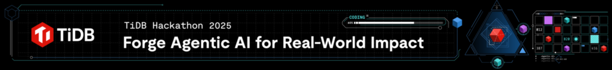
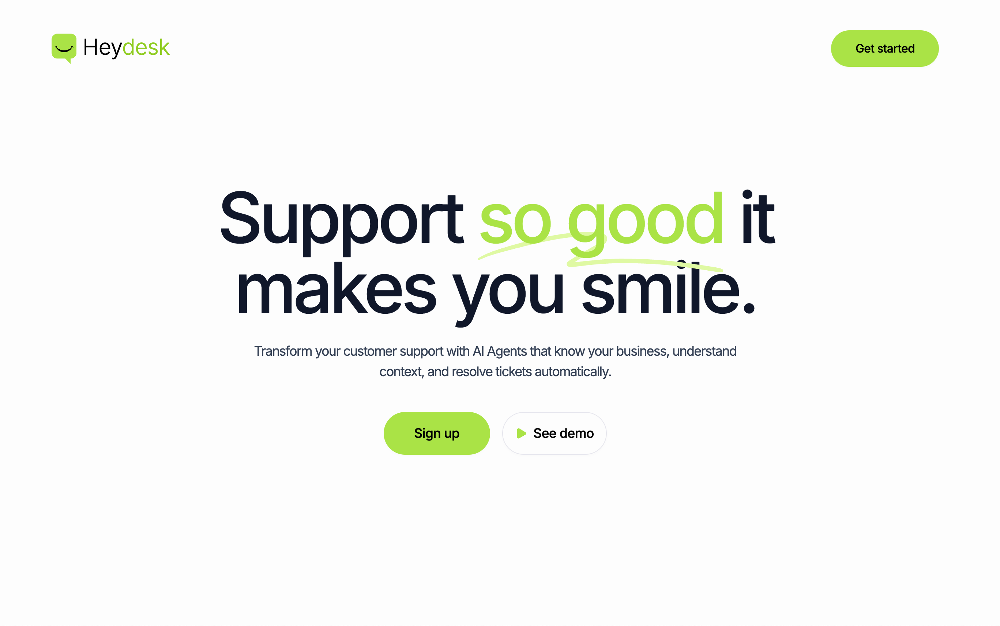
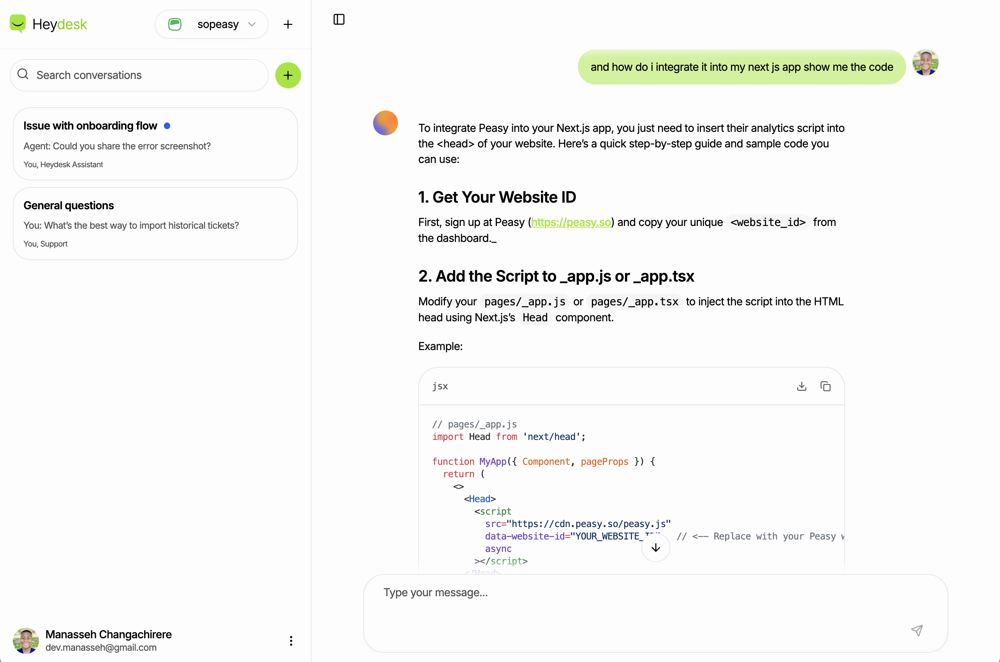
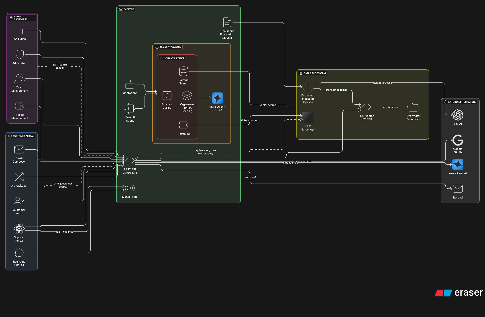

<p align="center">
  
  &nbsp;&nbsp;&nbsp;&nbsp;&nbsp;&nbsp;&nbsp;&nbsp;
</p>
<p align="center">
  
</p>

<h1 align="center">Heydesk</h1>

<p align="center">
  <em>Agentic customer support with human-in-the-loop, built for TiDB AgentX Hackathon 2025</em>
</p>

<p align="center">
  
  
  
  
  
  
</p>

<br/>

<p align="center ">
  
</p>

<p align="center ">
  
</p>

<!-- Architecture Diagram -->

<p align="center">
  
</p>

<p align="center">
  <a href="https://app.eraser.io/workspace/KKcCz1E28rHXUQLKJzK1?elements=q5UgI8MRwf629YhBJYObtg">Open interactive diagram</a>
</p>

Heydesk is a comprehensive agentic customer support platform that automatically builds knowledge bases from company websites, creates personalized AI agents, and provides dedicated support portals for customers. The system intelligently routes conversations through AI agents with access to company-specific knowledge, escalating only when human intervention is required.

## ✨ Key Differentiators

- **Automatic Knowledge Base Creation**: When an organization is created with a website URL, the system automatically scrapes and indexes the entire site using Exa AI, building a comprehensive knowledge base with vector embeddings for intelligent search.

- **Maya – Personalized AI Support Agent**: Every organization gets a pre-configured AI agent named Maya with organization-specific prompts and access to their knowledge base. Maya can search documents, create tickets, and provide contextual support.

- **Dedicated Support Portals**: Each organization gets a unique support portal (`support/{org-slug}`) where customers can authenticate, switch between organizations, and interact with AI agents that have access to company-specific knowledge.

- **Multi-Organization Customer Experience**: Customers can access multiple organizations through a single account, with a team switcher allowing seamless context switching between different support portals.

- **Human-in-the-loop by design**: Tickets are only created when AI determines human assistance is required. On creation, tickets are immediately assigned to the first available human agent with detailed context.

- **Email-first resolution**: Human agents send follow-up via email using rich templates and Resend .NET SDK integration. The UI includes a rich-text editor in a Sheet component that auto-closes on success while closing the ticket.

- **Custom TiDB SDK**: I built and integrated a custom .NET SDK for TiDB vectors and full-text search, published as `TiDB.Vector` and `TiDB.Vector.AzureOpenAI`. This SDK powers efficient RAG patterns and vector operations.

  - Repo: [TiDB.Vector.NET](https://github.com/manasseh-zw/TiDB.Vector.NET)
  - Referenced in `Heydesk.Server/Heydesk.Server.csproj` as `TiDB.Vector` and `TiDB.Vector.AzureOpenAI`.

- **Advanced Document Processing**: Supports URL scraping, file uploads, and text ingestion with intelligent chunking, HTML stripping, and vector indexing for optimal search performance.

- **Real-time Chat with Streaming**: WebSocket-based chat with token streaming, session management, and organization-aware prompt seeding for personalized AI interactions.

## 🏗️ Architecture

- **Frontend**: React (Vite), TypeScript, TanStack Router/Query, Shadcn UI

  - Rich email composition via Minimal Tiptap in a Sheet
  - Real-time support chat with streaming token updates

- **Backend**: .NET 9, EF Core, SignalR, Semantic Kernel

  - Chat runtime with session caching, function calling, and ticket plugin
  - Resend .NET SDK integration for outbound support emails and templating
  - Organization-aware prompt seeding for Maya

- **Data & AI**:
  - TiDB Serverless, vector & full-text via custom SDK
  - Azure OpenAI via Semantic Kernel for agent reasoning and streaming

## 🧩 Agent Tool Calls

Semantic Kernel function calling is enabled with automatic tool selection. The agent can invoke these tools as needed during chats:

- **KnowledgeBase.SearchKnowledgeBase(query)**: Searches the organization’s vectorized knowledge base and returns top results with metadata.
- **Tickets.CreateTicket(subject, context)**: Creates an escalated ticket from the current conversation and assigns it to the first available human agent in the organization.
- **Tickets.GetTicketStatus(ticketId)**: Retrieves status, timestamps, and contextual notes for an existing ticket.

This setup lets the agent self-serve common requests, then hand off cleanly with a concise ~60-word context note when human help is needed.

## 🔧 Custom TiDB .NET SDK

As part of this entry, we authored a .NET SDK for TiDB vector and Azure OpenAI integrations to streamline development and enable efficient hybrid RAG patterns.

- Repository: [TiDB.Vector.NET](https://github.com/manasseh-zw/TiDB.Vector.NET)
- Packages referenced in `Heydesk.Server.csproj`: `TiDB.Vector`, `TiDB.Vector.AzureOpenAI`
- Benefits: idiomatic C# APIs, consistent abstractions, performance-aware defaults

## 🔄 Complete Agentic Workflow

### Organization Setup

1. **Organization Creation**: Admin creates org with name, slug, and website URL
2. **Automatic Knowledge Base Building**: System scrapes the entire website using Exa AI, extracting content from main page + 20 subpages
3. **Vector Indexing**: Content is processed, chunked, and indexed into TiDB vector store with organization-specific collections
4. **Maya Agent Creation**: Default AI agent "Maya" is created with organization-personalized prompts and knowledge base access

### Customer Support Flow

1. **Support Portal Access**: Customer visits `support/{org-slug}` and authenticates
2. **Multi-Org Experience**: Customer can switch between organizations they have access to
3. **AI-Powered Chat**: Maya searches the knowledge base using vector similarity and provides contextual responses
4. **Intelligent Escalation**: When human help is needed, Maya creates a ticket with detailed context and assigns it to the first available human agent
5. **Email Resolution**: Human agent sends follow-up via rich email template, auto-closing the ticket on success

### Technical Flow

1. **URL Scraping**: Exa AI extracts content from website with intelligent summarization
2. **Document Processing**: Content is chunked (600 tokens, 80 overlap) and vectorized using Azure OpenAI embeddings
3. **Vector Search**: Maya searches organization-specific vector collections for relevant information
4. **LLM Integration**: Azure OpenAI GPT-4.1 processes search results and generates contextual responses
5. **Email Delivery**: Resend .NET SDK sends templated emails with organization branding

## 🚀 Getting Started

### Prerequisites

- Bun (preferred for the client)
- Node.js 18+
- .NET 9 SDK
- TiDB Cloud account
- Azure OpenAI keys
- Resend API key and sending domain
- Exa AI API key (for web scraping)

### Environment

Copy `.env.example` to `.env` files and configure:

```
# Server
CLOUD_DATABASE_URL=your_tidb_serverless_url
VECTOR_DATABASE_URL=your_tidb_vector_url
AZURE_OPENAI_API_KEY=...
AZURE_OPENAI_ENDPOINT=...
RESEND_APIKEY=...
RESEND_FROM_DOMAIN=heydesk.cc
EXA_API_KEY=...

# Client
VITE_API_BASE_URL=http://localhost:5176
```

### Install & Run

```bash
# Server
cd Heydesk.Server
dotnet restore
dotnet build
dotnet ef database update
dotnet run

# Client
cd ../Heydesk.Client
bun install
bun run dev
```

## ☁️ Deployment

- Backend: Containerize or deploy to any .NET-ready host; configure environment securely.
- Frontend: Static build via Vite; deploy to Vercel/Netlify and point to the server API.

## 🔗 Links

<div align="center">
  <a href="https://github.com/manasseh-zw/TiDB.Vector.NET">
    
  </a>&nbsp;&nbsp;

  <a href="https://tidb-2025-hackathon.devpost.com">
    
  </a>
</div>

---

<p align="center">
  <em>Heydesk ~ Agentic support with actual outcomes</em>
</p>
